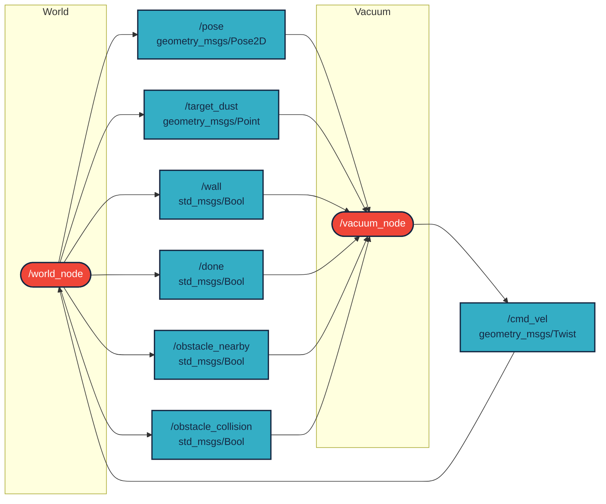

# `kaz_j25_ajr` package

ROS 2 C++ package. [](https://docs.ros.org/en/humble/)

A package két node-ból áll:

* A `/world_node` egy **Qt-alapú szimulációs környezetet** valósít meg, amely megjeleníti egy robotporszívó mozgását, a falakat, az akadályokat, a koszt és a takarítás folyamatát.
* A `/vacuum_node` egy **autonóm, akadályelkerülő porszívó logikát** valósít meg, amely a ROS-topicokon keresztül kap információt a világról, és ennek alapján vezérli saját mozgását.

A robot 10×10 m-es szobában mozog, koszt keres és felszívja azt. Továbbá kikerüli az esetleges akadályokat. A világ szimulálja az érzékelést, a mozgást, és minden komponens ROS 2 Humble alatt futtatható.

---

## Packages and build

It is assumed that the workspace is `~/ros2_ws/`.

### Clone the packages

```bash
cd ~/ros2_ws/src
```
```bash
git clone https://github.com/DrJegesmedve/kaz_j25_ajr
```

### Build ROS 2 packages

```bash
cd ~/ros2_ws
```
```bash
colcon build --packages-select kaz_j25_ajr --symlink-install
```

<details>
<summary> Don't forget to source before ROS commands.</summary>

```bash
source ~/ros2_ws/install/setup.bash
```

</details>

---

## Run

### Launch both nodes

```bash
ros2 launch kaz_j25_ajr vacuum_world.launch.py
```

### Or run manually

```bash
ros2 run kaz_j25_ajr world_node
```

```bash
ros2 run kaz_j25_ajr vacuum_node
```

---

## Graph



---

## Description

* **`world_node`**

  * Qt-based GUI simulation (10×10 m map)
  * Randomly generated dust spots
  * Randomly generated obstacles (*Due to randomness, rarely a closed obstacle configuration may block the accessto a small region and the robot can't fulfill its reason of existence*)
  * Publishes robot pose, wall proximity, dust targets, obstacle informations and completion status
  * Visualizes sensing radius (green), cleaned areas (purple), sensed cells (yellow), and remaining dust (gray), and obstacles (blue)

* **`vacuum_node`**

  * Receives robot position, wall and obstacle signals, and dust targets
  * Publishes movement commands (`/cmd_vel`)
  * Avoids walls and obstacles while navigating autonomously toward dust
  * Performs random exploration when no dust is known

---

## Example visualization


